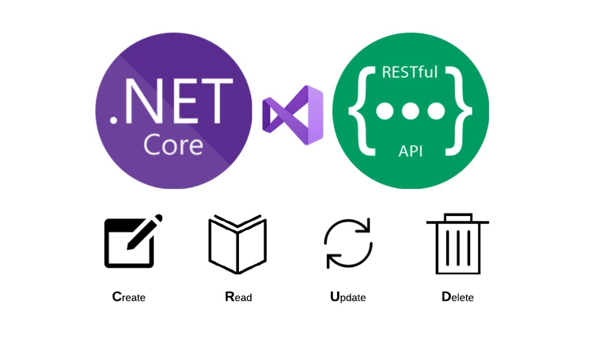

# Modern API Development with ASP.NET Core and .NET 8.0

Dive into the world of modern API development with ASP.NET Core in .NET 8.0! Learn to build a robust RESTful Web API seamlessly integrated with Entity Framework Core. Discover the power of testing your API with Swagger and ensure efficient data management by storing your data in Microsoft SQL Server Management Studio.

## Tutorial Article

Check out the tutorial on Medium: [Build a .NET 8 RESTful Web API: Testing with Swagger and SQL Server Integration](https://medium.com/@cydexcode/build-a-net-8-restful-web-api-testing-with-swagger-and-sql-server-integration-8d18336ebaa2)

## Next Article Preview

Stay tuned for the next article where we'll demonstrate how to establish a connection between this RESTful API and a frontend application built using React.

## Check Out My Blog 

- **Blog (Medium):** [https://medium.com/@cydexcode](https://medium.com/@cydexcode)

